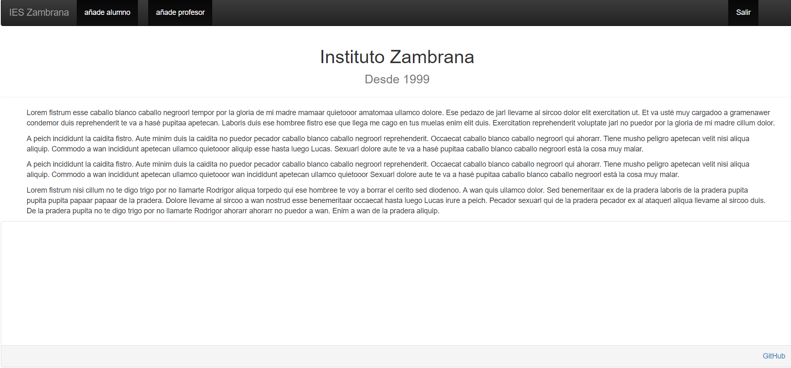
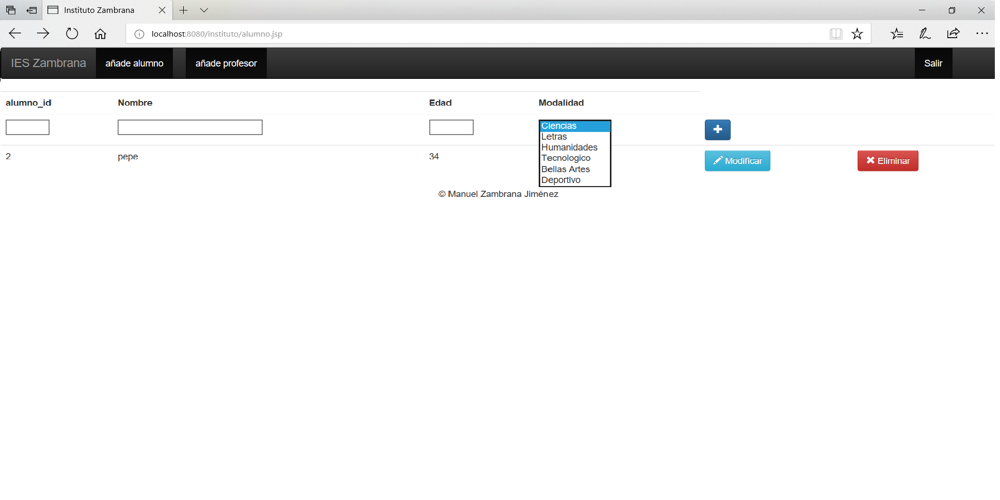

# CRUD_JSP

Este ejercicio consistirá en un CRUD sobre los datos de un instituto, donde tendremos tablas como: Alumnos, Profesores, asiganturas,material etc...

El inicio sesión del crud costa de un E-mail y contraseña para poder entrar
(Vale cualquiera ya que no hay registro de usuario)

Una vez dentro podremos ver un simple inicio con LoremIpsum para rellenar
Aquí podremos ver una barra de navegación también

En añade alumnos podremos entrar a una pestaña para poder añadir alumnos

